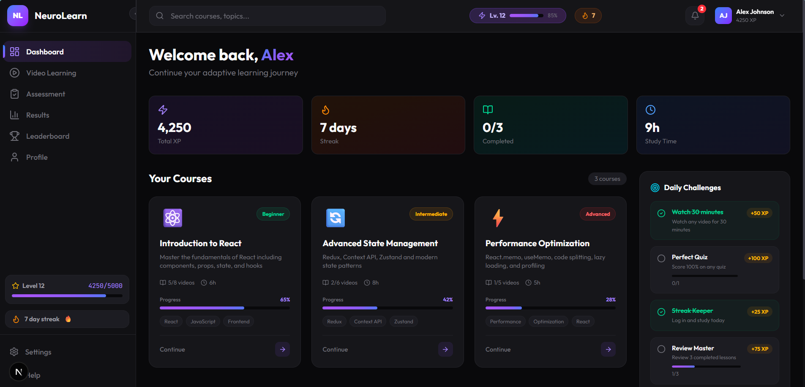
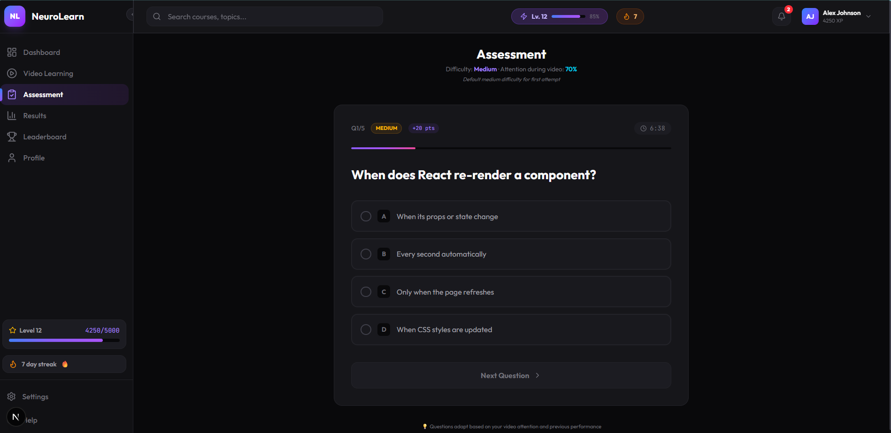
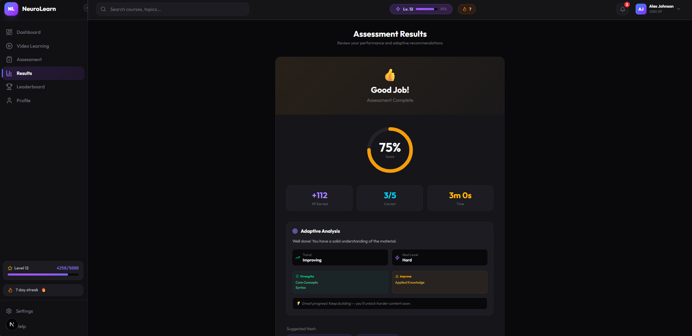

# NeuroLearn — Adaptive Learning Platform

AI-powered e-learning platform with real-time attention monitoring, live video transcription, adaptive assessments, and gamification.

---

## Demo Screens

### Dashboard
<p align="center">
  
</p>

### Video Learning
<p align="center">
  
</p>

### Assessment
<p align="center">
  
</p>

### Result
<p align="center">
  
</p>

📄 **Assessment Report:** [View PDF](demo_files/NeuroLearn_Report_1772355573144.pdf)

```bash
cd neurolearn
npm install
npm run dev
# → Open http://localhost:3000
```

The frontend runs with **built-in dummy data** — no backend needed to explore the UI.

---

## Quick Start (Full Stack — Frontend + FastAPI Backend)

### Terminal 1: Backend
```bash
cd backend
python -m venv venv
source venv/bin/activate          # Windows: venv\Scripts\activate
pip install fastapi uvicorn tinydb loguru python-dotenv
python main.py
# → API running at http://localhost:8000
# → Swagger docs at http://localhost:8000/docs
```

### Terminal 2: Frontend
```bash
npm install
npm run dev
# → Open http://localhost:3000
```

The frontend auto-detects whether the backend is running:
- **Backend UP** → uses real FastAPI endpoints + ML models
- **Backend DOWN** → falls back to local dummy data seamlessly

---

## Full ML Installation (Optional — for live AI features)

```bash
cd backend
pip install -r requirements.txt
```

This installs:
- **MediaPipe** → webcam attention detection (eye tracking, head pose, blink rate)
- **OpenAI Whisper** → live video transcription
- **FLAN-T5** → AI question generation from transcripts
- **PyTorch** → ML model runtime

Without these, the backend uses realistic **dummy data** in the exact same JSON format.

---

## Architecture

```
neurolearn/
├── app/                          # Next.js App Router pages
│   ├── page.tsx                  # Landing / splash redirect
│   ├── globals.css               # Dark theme + animations
│   ├── layout.tsx                # Root layout
│   ├── dashboard/                # Course grid + gamification
│   │   ├── layout.tsx
│   │   └── page.tsx
│   ├── video/                    # Video player + camera + AI panels
│   │   ├── layout.tsx
│   │   └── page.tsx
│   ├── assessment/               # Adaptive quiz
│   │   ├── layout.tsx
│   │   └── page.tsx
│   ├── results/                  # Score + adaptive feedback
│   │   ├── layout.tsx
│   │   └── page.tsx
│   ├── leaderboard/              # Global rankings
│   │   ├── layout.tsx
│   │   └── page.tsx
│   └── profile/                  # Student profile + badges
│       ├── layout.tsx
│       └── page.tsx
│
├── components/                   # Reusable UI components
│   ├── Sidebar.tsx               # Collapsible nav with XP/streak
│   ├── Navbar.tsx                # Top bar with search, notifs, profile
│   ├── TopicCard.tsx             # Course card with progress
│   ├── VideoPlayer.tsx           # MP4 + YouTube + any URL support
│   ├── CameraFeed.tsx            # Webcam → base64 frames → POST to API
│   ├── AttentionPanel.tsx        # Real-time attention score gauge
│   ├── TranscriptionPanel.tsx    # Live transcript synced to video
│   ├── VideoLinkSelector.tsx     # Course video picker
│   ├── AssessmentCard.tsx        # Quiz question with MCQ selection
│   └── ResultCard.tsx            # Score display + adaptive feedback
│
├── lib/
│   ├── api.ts                    # API layer (FastAPI → fallback → dummy)
│   ├── dummyDb.ts                # Local dummy data (all types + data)
│   └── utils.ts                  # cn() helper
│
├── backend/                      # FastAPI Python backend
│   ├── main.py                   # Entry point
│   ├── schemas/models.py         # Pydantic JSON models
│   ├── data/database.py          # TinyDB dummy database
│   ├── ml/
│   │   ├── attention_model.py    # MediaPipe face mesh → attention score
│   │   ├── transcription_model.py # Whisper → transcript segments
│   │   ├── question_generator.py # FLAN-T5 → quiz questions
│   │   └── adaptive_engine.py    # Score+attention → difficulty
│   └── routers/
│       ├── student.py            # Profile, XP
│       ├── courses.py            # Course listing, videos
│       ├── attention.py          # Camera frame → score
│       ├── transcription.py      # Video → transcript
│       ├── assessment.py         # Quiz generate + submit
│       └── gamification.py       # Leaderboard, challenges
│
├── package.json
├── tsconfig.json
├── next.config.mjs
├── postcss.config.mjs
├── .env.local                    # NEXT_PUBLIC_API_URL
└── README.md
```

---

## Data Flow: Frontend ↔ Backend

### Video Learning Session

```
Student opens /video?course=course_001

1. Frontend fetches course → GET /api/courses/course_001
2. Student plays video (MP4/YouTube/any URL)
3. Camera starts → captures frame every 3 seconds
4. Frame sent → POST /api/attention/snapshot
   Backend: MediaPipe Face Mesh → eye_contact, head_pose, blink_rate → score
   Returns: { score: 82, state: "attentive", model_response: {...} }
5. AttentionPanel updates in real-time
6. TranscriptionPanel polls → GET /api/transcription/{id}/live?current_time=15.3
   Backend: Whisper → text + word timestamps
   Returns: { text: "...", confidence: 0.94, model_response: {...} }
7. Video ends → "Take Assessment" button appears
```

### Assessment Flow

```
Student clicks "Take Assessment"

1. Navigate to /assessment?course=X&video=Y&attention=78
2. Frontend sends → POST /api/assessment/generate
   Body: { course_id, video_id, attention_score: 78, transcript_text: "..." }
   Backend: Adaptive Engine picks difficulty + FLAN-T5 generates questions
   Returns: { questions: [...], difficulty: "medium", adaptive_metadata: { reason } }
3. Student answers 5 questions (timer running)
4. Frontend sends → POST /api/assessment/submit
   Body: { session_id, answers: { q1: 1, q2: 0 }, time_spent: 180 }
   Backend: Grade → Adaptive Engine → XP calculation
   Returns: {
     score: 80%, xp_earned: 120,
     adaptive_response: {
       performance_trend: "improving",
       next_assessment_difficulty: "hard",
       strength_areas: ["Core Concepts"],
       weak_areas: ["Applied Knowledge"]
     }
   }
5. Navigate to /results → shows score, XP, feedback, next steps
```

---

## API Endpoints Reference

| Method | Endpoint | Description |
|--------|----------|-------------|
| GET | `/api/student/profile` | Student profile + badges |
| POST | `/api/student/xp` | Award XP (handles level-up) |
| GET | `/api/courses` | All courses with progress |
| GET | `/api/courses/{id}` | Course details + video links |
| GET | `/api/courses/{id}/videos/{vid}` | Specific video |
| **POST** | **`/api/attention/snapshot`** | **Camera frame → ML → attention score** |
| GET | `/api/attention/dummy-snapshot` | Test without camera |
| GET | `/api/attention/history` | Session attention logs |
| GET | `/api/transcription/{id}` | Full video transcript |
| GET | `/api/transcription/{id}/live` | Segment at timestamp |
| POST | `/api/transcription/chunk` | Transcribe audio chunk |
| **POST** | **`/api/assessment/generate`** | **Generate adaptive quiz** |
| **POST** | **`/api/assessment/submit`** | **Submit answers → get adaptive result** |
| GET | `/api/leaderboard` | Global rankings |
| GET | `/api/challenges/daily` | Daily challenges |
| GET | `/api/notifications` | Student notifications |
| GET | `/health` | ML model status |

---

## Environment Variables

### Frontend (`.env.local`)
```
NEXT_PUBLIC_API_URL=http://localhost:8000/api
```

### Backend (`.env`)
```
HOST=0.0.0.0
PORT=8000
CORS_ORIGINS=http://localhost:3000
WHISPER_MODEL_SIZE=base
FLAN_T5_MODEL=google/flan-t5-base
DB_PATH=./data/neurolearn_db.json
```

---

## Video URL Support

The VideoPlayer auto-detects and handles:

| URL Type | Example | Method |
|----------|---------|--------|
| Direct MP4 | `https://example.com/video.mp4` | Native `<video>` element |
| YouTube | `youtube.com/watch?v=X` or `youtu.be/X` | Auto-converts to embed iframe |
| Any embed | Other video pages | iframe fallback |

Use the "Play Custom URL" button on the video page to paste any URL.

---

## Tech Stack

**Frontend:** Next.js 16, React 19, TypeScript, Tailwind CSS v4, Framer Motion

**Backend:** FastAPI, Pydantic, TinyDB, Loguru

**ML Models:** MediaPipe (attention), Faster Whisper (transcription), FLAN-T5 (questions), Custom adaptive engine

---

## Pages

| Route | Page | Description |
|-------|------|-------------|
| `/` | Splash | Animated logo → redirect to dashboard |
| `/dashboard` | Dashboard | Course grid, XP stats, daily challenges, badges |
| `/video` | Video Learning | Video player, camera feed, attention monitor, transcription |
| `/assessment` | Assessment | Adaptive quiz with timer |
| `/results` | Results | Score gauge, XP earned, adaptive feedback |
| `/leaderboard` | Leaderboard | Global rankings with podium |
| `/profile` | Profile | Student info, achievements, stats |

